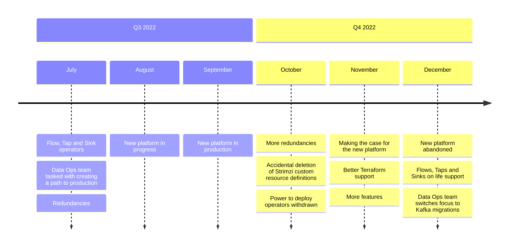
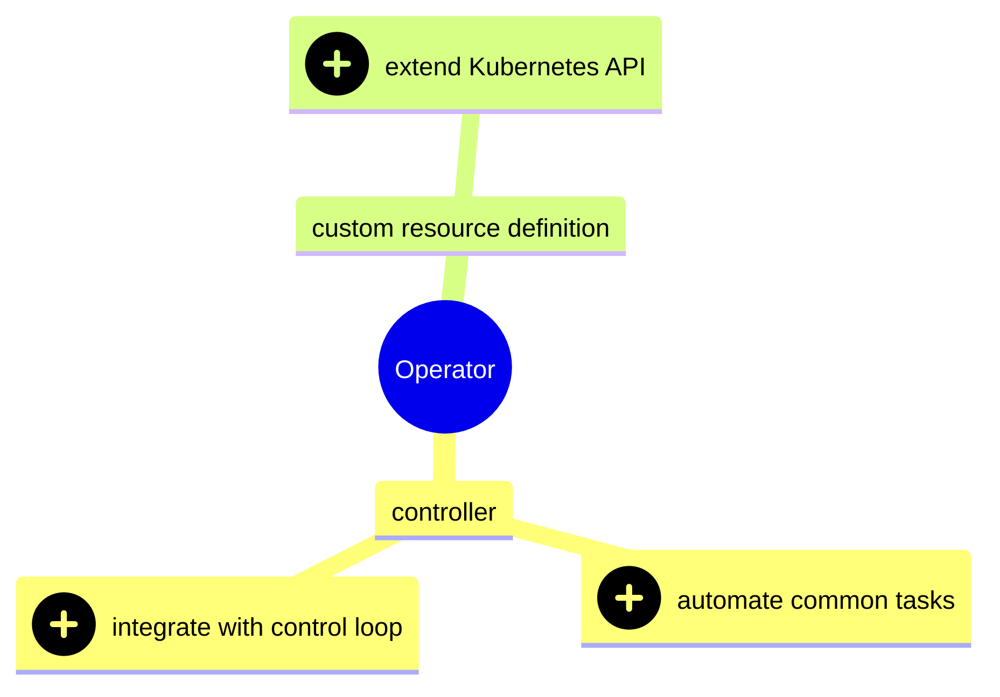
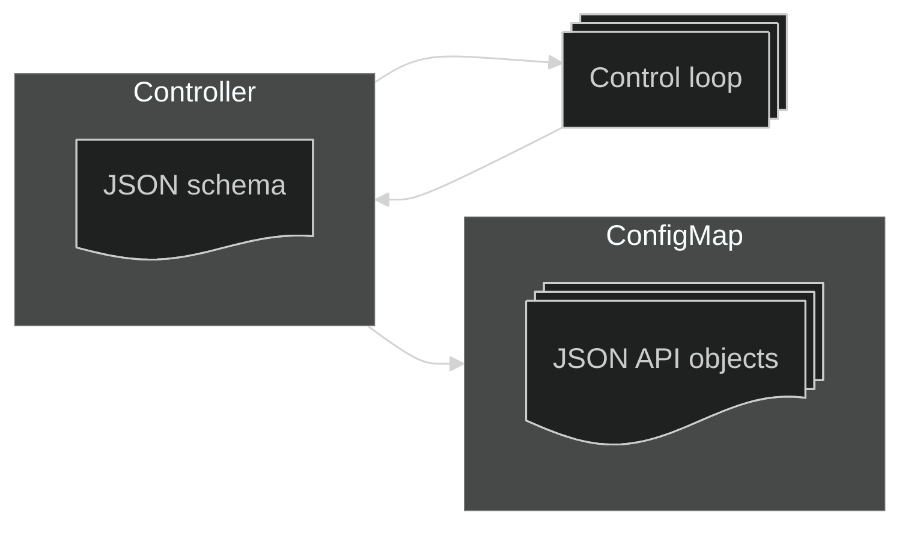

<link href="//netdna.bootstrapcdn.com/font-awesome/4.1.0/css/font-awesome.min.css" rel="stylesheet">
<link rel="stylesheet" href="https://cdnjs.cloudflare.com/ajax/libs/highlight.js/11.10.0/styles/light.min.css">

# The operator antipattern {bgcss=sg15 .light-on-dark}

Kubernetes Community Days London 2024

Gerald Schmidt

</smaller>

<aside class="notes">I've been a big fan of the operator pattern for years. This is my attempt to explain why I've fallen out of love with it.</aside>

# {bgcss=sg14 .light-on-dark}
<iframe id="copyconstruct" width="550" height="480" frameBorder="0" title="Cindy Sridharan" src="assets/copyconstruct/index.html">
</iframe>
<small>Classic Sridharan:<br/><a href="https://copyconstruct.medium.com/testing-microservices-the-sane-way-9bb31d158c16">Testing Microservices, the sane way</a> (2017) |
<a href="https://medium.com/@copyconstruct/testing-in-production-the-safe-way-18ca102d0ef1">Testing in Production, the safe way</a> (2018) |
<a href="https://copyconstruct.medium.com/testing-in-production-the-hard-parts-3f06cefaf592">Testing in Production: the hard parts</a> (2019)</small>

<aside class="notes">I would highlight 'overstaffed', 'complex systems' and of course 'every tech trend of the 2010s' - clearly a reference to Kubernetes. We certainly had to brace ourselves for Q1 2023.</aside>

# {bgcss=sg13 .light-on-dark}


<small>Source: <a href="https://layoffs.fyi/">layoffs.fyi</a></small>

<aside class="notes">The figures are almost unbelievably high. What we have to think about is what happens to teams that are cut down to half their previous size. We have to assume our capacity to manage our infrastructure may decline as well as grow.</aside>

# Startup world in 2022 {bgcss=sg12}


<aside class="notes">Let me stress that this is not my current employer. This is where operators come to the fore. The excellent engineering director Richard told me about data flows involving Flows, Sinks and Taps - and looked at me expectantly. Now the team had already built this, but already a problem appeared: the operator could not be deployed using the usual tools.</aside>

# {bgcss=sg11 .with-links}

An Operator is an application-specific controller that extends the Kubernetes API to create, configure, and manage instances of complex stateful applications on behalf of a Kubernetes user. It builds upon the basic Kubernetes resource and controller concepts but includes domain or application-specific knowledge to automate common tasks.

<small>Brandon Philips, <a href="https://www.redhat.com/en/blog/introducing-operators-putting-operational-knowledge-into-software">Introducing Operators: Putting Operational Knowledge into Software</a> (2016)</small>

<aside class="notes">This is probably the best definition we have. Let's break it down.</aside>

# {bgcss=sg10}


<aside class="notes">We have the 'complex stateful applications' in bold, also the complementary pairing of controller and API extension.</aside>

# Great expectations ① {bgcss=sg10 .with-links}
Operators promised to solve the problem of stateful applications on Kubernetes.

One issue is that operators didn't do so convincingly.

Another is that arguably Kubernetes never had a stateful application problem; it had a persistent volume problem.

<small>See <a href="https://medium.com/go-city/object-storage-for-stateful-applications-on-kubernetes-35dc2388cb2f">Object storage for stateful applications on Kubernetes</a> (2022).</small>

<aside class="notes">This is the seed of the expectation that operators will somehow come to the rescue of stateful applications.</aside>

# Tiered storage: Thanos {bgcss=sg10}


<aside class="notes"></aside>

# Object storage only: WarpStream {bgcss=sg10 .with-links}
'Zero disks would be better.'

<small>Richard Artoul, <a href="https://www.warpstream.com/blog/tiered-storage-wont-fix-kafka">Tiered Storage Won't Fix Kafka</a> (28 April 2024). On 9 September 2024, Confluent announced that it had <a href="https://www.confluent.io/en-gb/blog/confluent-acquires-warpstream/">acquired WarpStream</a>.</small>

<aside class="notes"></aside>

# Waiting for COSI {bgcss=sg10 .with-links}


<small>See <a href="https://container-object-storage-interface.github.io/">container-object-storage-interface.github.io</a>.</small>

<aside class="notes"></aside>

# Great expectations ② {bgcss=sg10}
Operators promised to help us move from managed and mostly proprietary services to portable Kubernetes environments hosting many open source operators.


<aside class="notes"></aside>

# There was another group cheering us on {bgcss=sg10}
That group is best described as everyone except Amazon.

<image src="assets/img/public-cloud.png"/>

<aside class="notes"></aside>

# What a three-year head start gives you {bgcss=sg10}
<small>Alexa for Business, Amazon AppFlow, Amazon Augmented AI, Amazon Bedrock, Amazon Braket, Amazon Chime, Amazon CodeGuru, Amazon Comprehend, Amazon Connect, Amazon DocumentDB, Amazon EventBridge, Amazon DataZone, Amazon Forecast, Amazon Fraud Detector, Amazon GameLift, Amazon Honeycode, Amazon Interactive Video Service, Amazon Kendra, Amazon Keyspaces, Amazon Lex, Amazon Macie, Amazon Managed Blockchain, Amazon MQ, Amazon Personalize, Amazon Polly, Amazon QLDB, Amazon Redshift, Amazon Rekognition, Amazon SageMaker, Amazon Sumerian, Amazon Textract, Amazon Transcribe, Amazon Translate, API Gateway, Application Discovery Service, AppStream 2.0, Artifact, Athena, AWS Amplify, AWS App Mesh, AWS AppConfig, AWS AppSync, AWS Auto Scaling, AWS Backup, AWS Budgets, AWS Chatbot, AWS Cloud Map, AWS Compute Optimizer, AWS Cost Explorer, AWS Data Exchange, AWS DeepComposer, AWS DeepLens, AWS DeepRacer, AWS Firewall Manager, AWS Glue, AWS IQ, AWS Lake Formation, AWS License Manager, AWS Marketplace Subscriptions, AWS Migration Hub, AWS Organizations, AWS Outposts, AWS RoboMaker, AWS Single Sign-On, AWS Snow Family, AWS Transfer Family, AWS Well-Architected Tool, Batch, Certificate Manager, Cloud9, CloudFormation, CloudFront, CloudHSM, CloudSearch, CloudTrail, CloudWatch, CodeArtifact, CodeBuild, CodeCommit, CodeDeploy, CodePipeline, CodeStar, Cognito, Config, Control Tower, Data Pipeline, Database Migration Service, DataSync, Detective, Device Farm, Direct Connect, Directory Service, DynamoDB, EC2, EC2 Image Builder, EFS, Elastic Beanstalk, Elastic Container Registry, Elastic Container Service, Elastic Kubernetes Service, Elastic Transcoder, ElastiCache, Elasticsearch Service, Elemental Appliances & Software, EMR, FreeRTOS, FSx, Global Accelerator, Ground Station, GuardDuty, IAM, Inspector, IoT 1-Click, IoT Analytics, IoT Core, IoT Device Defender, IoT Device Management, IoT Events, IoT Greengrass, IoT SiteWise, IoT Things Graph, Key Management Service, Kinesis, Kinesis Video Streams, Lambda, Launch Wizard, Lightsail, Managed Services, MediaConnect, MediaConvert, MediaLive, MediaPackage, MediaStore, MediaTailor, Mobile Hub, MSK, Neptune, OpsWorks, Personal Health Dashboard, Pinpoint, QuickSight, RDS, Resource Access Manager, Route 53, S3, S3 Glacier, Secrets Manager, Security Hub, Server Migration Service, Serverless Application Repository, Service Catalog, Simple Email Service, Simple Notification Service, Simple Queue Service, Step Functions, Storage Gateway, Support, SWF, Systems Manager, Trusted Advisor, VPC, WAF & Shield, WorkDocs, WorkLink, WorkMail, WorkSpaces, X-Ray</small>

# Competitive advantage or liability {bgcss=sg10}


<aside class="notes"></aside>

# The operators we got weren't the ones we expected {bgcss=sg10}
We kept using managed services as before and every self-respecting open source project added custom resource definitions.


<aside class="notes"></aside>

# {bgcss=sg10}


<aside class="notes"></aside>

# {bgcss=sg10}


<aside class="notes"></aside>

# Developer experience {bgcss=sg10 .with-links}

'Nothing is simple about writing a CRD.'

<small>Adam Jacob, <a href="https://changelog.com/shipit/126">Kubernetes is an anti-platform</a>, Ship It (18 October 2024)</small>

<aside class="notes"></aside>

# User experience {bgcss=sg10}
Let's take a look at the Kubernetes Prometheus Stack README.

```md
### From 64.x to 65.x

This version upgrades Prometheus-Operator to v0.77.1

Run these commands to update the CRDs before applying the upgrade.

kubectl apply ... -f https://.../alertmanagerconfigs.yaml
kubectl apply ... -f https://.../alertmanagers.yaml
kubectl apply ... -f https://.../podmonitors.yaml
kubectl apply ... -f https://.../probes.yaml
kubectl apply ... -f https://.../prometheusagents.yaml
kubectl apply ... -f https://.../prometheuses.yaml
kubectl apply ... -f https://.../prometheusrules.yaml
kubectl apply ... -f https://.../scrapeconfigs.yaml
...
```
<aside class="notes"></aside>

# {bgcss=sg10}


<aside class="notes"></aside>

#  Service targeting Prometheus v1.0.0 {bgcss=sg10}

```yaml
apiVersion: v1
kind: Service
metadata:
  annotations:
    prometheus.io/port: "2112"
    prometheus.io/scrape: "true"
```
#  Service targeting current Prometheus {bgcss=sg10}

```yaml
apiVersion: v1
kind: Service
metadata:
  ...
---
apiVersion: monitoring.coreos.com/v1
kind: ServiceMonitor
metadata:
  namespace: monitoring
spec:
  endpoints:
    ...
```
<aside class="notes"></aside>

# Antipattern ① &ndash; developers building operators {bgcss=sg09}
e.g. Flow, Tap and Sink


<aside class="notes"></aside>

# Antipattern ② &ndash; tight coupling with external resources {bgcss=sg08}
e.g. Strimzi


<aside class="notes"></aside>

# Antipattern ③ &ndash; versioning is hard {bgcss=sg07 .light-on-dark}
e.g. AWS Controllers for Kubernetes

```yaml
apiVersion: s3.services.k8s.aws/v1alpha1
kind: Bucket
```

Is the old version still served? Have we provided a conversion webhook?

We are introducing new failure modes and edge cases.

<aside class="notes"></aside>

# There are many outstanding operators {bgcss=sg06 .light-on-dark}
Kyverno for example stands out as an operator that has the look and feel of an in-tree policy engine.

Policy violations create detailed events and the new resources (Policy, ClusterPolicy) fit well into the existing set of resources.

```text
$ kubectl get events --sort-by='{.lastTimestamp}'
TYPE    REASON          MESSAGE
Warning PolicyViolation policy require-ro-rootfs/validate-
                        readOnlyRootFilesystem fail: validation
                        error: Root filesystem must be read-only.
                        rule validate-readOnlyRootFilesystem failed at
                        path /spec/template/spec/containers/0/
                        securityContext/readOnlyRootFilesystem/
```

<aside class="notes"></aside>

# {bgcss=sg05}


<aside class="notes"></aside>

# A controller revival is overdue {bgcss=sg04 .light-on-dark}

Grafana loads ConfigMaps with label `grafana_dashboard` set to value `1`.

The only format required is Grafana's native JSON format.

```bash
for DASHBOARD in \
  $(ls kube-prometheus-stack/dashboards/*.json)
do
  CONFIGMAP=$(basename "${DASHBOARD}" | cut -d'.' -f1)
  kubectl create configmap "${CONFIGMAP}" \
    -n monitoring \
    --dry-run=client \
    --from-file="${DASHBOARD}" -o yaml | \
    kubectl apply -f -
  kubectl label configmap "${CONFIGMAP}" \
    -n monitoring \
    --overwrite grafana_dashboard="1"
done
``` 

<aside class="notes"></aside>

# {bgcss=sg03 .light-on-dark}



<aside class="notes"></aside>

# Thank you {bgcss=sg02 .light-on-dark}
<i class="fa fa-github" aria-hidden="true"></i> <a href="https://github.com/gerald1248/operator-antipattern-slides">gerald1248/operator-antipattern-slides</a><br/>
<i class="fa fa-envelope" aria-hidden="true"></i> <a href="mailto:gerald1248@gmail.com">gerald1248@gmail.com</a><br/>
<i class="fa fa-linkedin" aria-hidden="true"></i> <a href="https://www.linkedin.com/in/gerald1248/">www.linkedin.com/in/gerald1248</a><br/>
<i class="fa fa-twitter" aria-hidden="true"></i> <a href="https://x.com/03spirit">03spirit</a>
