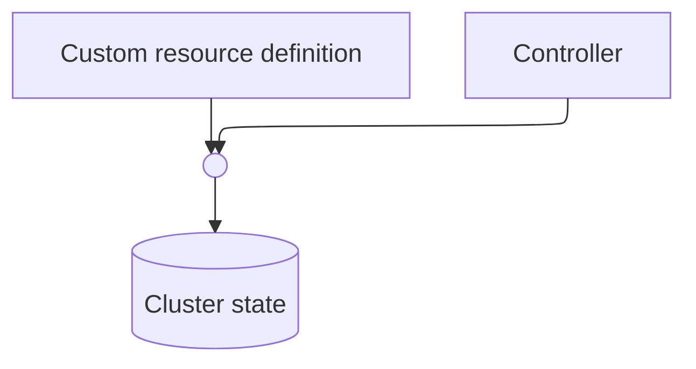

# The operator antipattern {bgcss=bg-colorful .light-on-dark}

<smaller>Kubernetes Community Days London 2024</smaller>

<smaller>Gerald Schmidt</smaller>

</smaller>

# {bgcss=bg-purple .light-on-dark}

<!---->
 
<small>Source: <a href="https://simpsons.fandom.com/wiki/Springfield_Box_Factory">simpsons.fandom.com/wiki/Springfield_Box_Factory</a></small>

# {bgcss=bg-yellow}
<iframe id="copyconstruct" width="550" height="480" frameBorder="0" title="Cindy Sridharan" src="assets/copyconstruct/index.html">
</iframe>

# {bgcss=bg-dark-grey .light-on-dark}

<small>Source: <a href="https://layoffs.fyi/">layoffs.fyi</a></small>

# Benefits {bgcss=bg-light-blue}

# Benefits {bgcss=bg-light-blue}

# Benefits {bgcss=bg-light-blue}

# Kube-prometheus-operator {bgcss=bg-middle-blue}

# Topic E {bgcss=bg-dark-blue .light-on-dark}

# Topic F {bgcss=bg-green}

# Topic G {bgcss=bg-pink .light-on-dark}

# DS Smith {bgcss=bg-colorful .light-on-dark}
