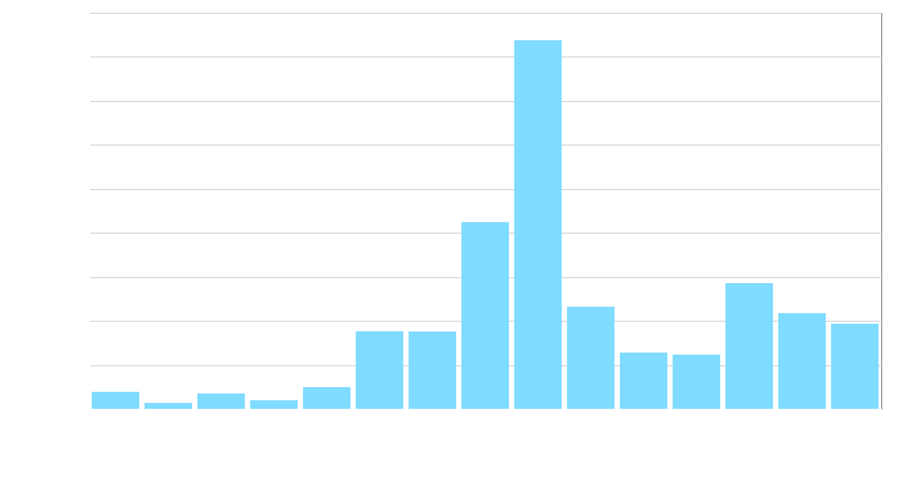
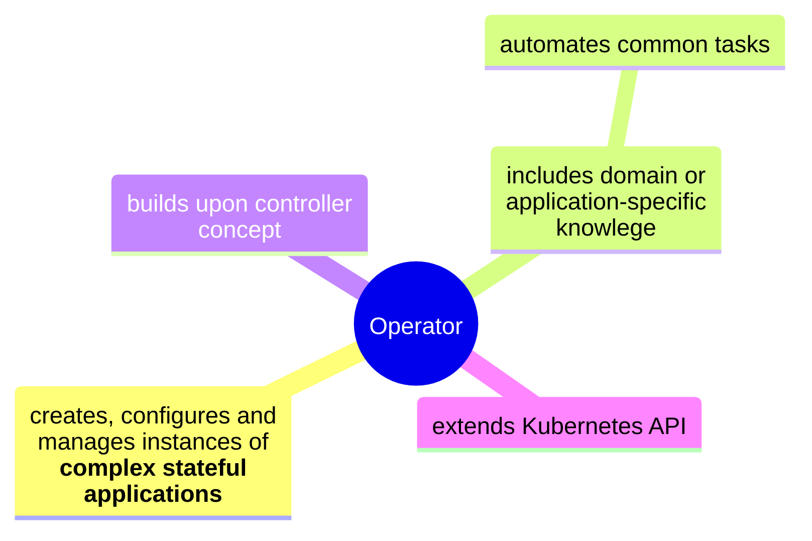
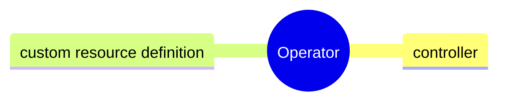
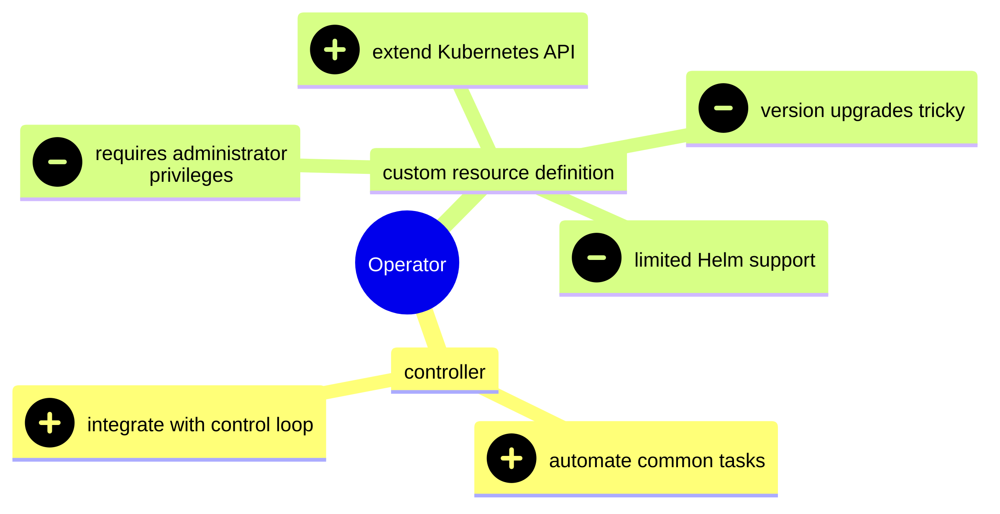

<link href="//netdna.bootstrapcdn.com/font-awesome/4.1.0/css/font-awesome.min.css" rel="stylesheet">
<link rel="stylesheet" href="https://cdnjs.cloudflare.com/ajax/libs/highlight.js/11.10.0/styles/light.min.css">

# The operator antipattern {bgcss=sg15 .light-on-dark}

Kubernetes Community Days London 2024

Gerald Schmidt

</smaller>

<!--# {bgcss=sg14 .light-on-dark}
-->
<!---->
<!--<br/>
<small>Source: <a href="https://simpsons.fandom.com/wiki/Springfield_Box_Factory">simpsons.fandom.com/wiki/Springfield_Box_Factory</a></small>-->

# {bgcss=sg14 .light-on-dark}
<iframe id="copyconstruct" width="550" height="480" frameBorder="0" title="Cindy Sridharan" src="assets/copyconstruct/index.html">
</iframe>
<small>Classic Sridharan:<br/><a href="https://copyconstruct.medium.com/testing-microservices-the-sane-way-9bb31d158c16">Testing Microservices, the sane way</a> (2017) |
<a href="https://medium.com/@copyconstruct/testing-in-production-the-safe-way-18ca102d0ef1">Testing in Production, the safe way</a> (2018) |
<a href="https://copyconstruct.medium.com/testing-in-production-the-hard-parts-3f06cefaf592">Testing in Production: the hard parts</a> (2019)</small>

# {bgcss=sg13 .light-on-dark}

<small>Source: <a href="https://layoffs.fyi/">layoffs.fyi</a></small>

# {bgcss=sg12 .light-on-dark}


# {bgcss=sg11 .with-links}

An Operator is an application-specific controller that extends the Kubernetes API to create, configure, and manage instances of complex stateful applications on behalf of a Kubernetes user. It builds upon the basic Kubernetes resource and controller concepts but includes domain or application-specific knowledge to automate common tasks.

<small>Brandon Philips, <a href="https://www.redhat.com/en/blog/introducing-operators-putting-operational-knowledge-into-software">Introducing Operators: Putting Operational Knowledge into Software</a> (2016)</small>

# {bgcss=sg10}


# Great expectations ① {bgcss=sg10 .with-links}
Operators promised to solve the problem of stateful applications on Kubernetes.

One issue is that operators couldn't and didn't do any such thing. Calling a resource 'Database' and adding a backup task doesn't magically achieve managed service level availability and durability.

Another is that arguably Kubernetes never had a stateful application problem; it had a persistent volume problem.

<small>See <a href="https://medium.com/go-city/object-storage-for-stateful-applications-on-kubernetes-35dc2388cb2f">Object storage for stateful applications on Kubernetes</a> (2022).</small>

# Enter Thanos and WarpStream stage left and right {bgcss=sg10}


# Waiting for COSI {bgcss=sg10 .with-links}


<small><a href="https://container-object-storage-interface.github.io/">container-object-storage-interface.github.io</a></small>

# Great expectations ② {bgcss=sg10}
Many of us imagined that operators would help us move from managed and mostly proprietary services to portable Kubernetes environments teeming with open source operators.


# There was another group cheering us on {bgcss=sg10}
That group is best described as everyone except Amazon.

<image src="assets/img/public-cloud.png"/>

# What a three-year head start buys you {bgcss=sg10}
<small>Alexa for Business, Amazon AppFlow, Amazon Augmented AI, Amazon Braket, Amazon Chime, Amazon CodeGuru, Amazon Comprehend, Amazon Connect, Amazon DocumentDB, Amazon EventBridge, Amazon Forecast, Amazon Fraud Detector, Amazon GameLift, Amazon Honeycode, Amazon Interactive Video Service, Amazon Kendra, Amazon Keyspaces, Amazon Lex, Amazon Macie, Amazon Managed Blockchain, Amazon MQ, Amazon Personalize, Amazon Polly, Amazon QLDB, Amazon Redshift, Amazon Rekognition, Amazon SageMaker, Amazon Sumerian, Amazon Textract, Amazon Transcribe, Amazon Translate, API Gateway, Application Discovery Service, AppStream 2.0, Artifact, Athena, AWS Amplify, AWS App Mesh, AWS AppConfig, AWS AppSync, AWS Auto Scaling, AWS Backup, AWS Budgets, AWS Chatbot, AWS Cloud Map, AWS Compute Optimizer, AWS Cost Explorer, AWS Data Exchange, AWS DeepComposer, AWS DeepLens, AWS DeepRacer, AWS Firewall Manager, AWS Glue, AWS IQ, AWS Lake Formation, AWS License Manager, AWS Marketplace Subscriptions, AWS Migration Hub, AWS Organizations, AWS Outposts, AWS RoboMaker, AWS Single Sign-On, AWS Snow Family, AWS Transfer Family, AWS Well-Architected Tool, Batch, Certificate Manager, Cloud9, CloudFormation, CloudFront, CloudHSM, CloudSearch, CloudTrail, CloudWatch, CodeArtifact, CodeBuild, CodeCommit, CodeDeploy, CodePipeline, CodeStar, Cognito, Config, Control Tower, Data Pipeline, Database Migration Service, DataSync, Detective, Device Farm, Direct Connect, Directory Service, DynamoDB, EC2, EC2 Image Builder, EFS, Elastic Beanstalk, Elastic Container Registry, Elastic Container Service, Elastic Kubernetes Service, Elastic Transcoder, ElastiCache, Elasticsearch Service, Elemental Appliances & Software, EMR, FreeRTOS, FSx, Global Accelerator, Ground Station, GuardDuty, IAM, Inspector, IoT 1-Click, IoT Analytics, IoT Core, IoT Device Defender, IoT Device Management, IoT Events, IoT Greengrass, IoT SiteWise, IoT Things Graph, Key Management Service, Kinesis, Kinesis Video Streams, Lambda, Launch Wizard, Lightsail, Managed Services, MediaConnect, MediaConvert, MediaLive, MediaPackage, MediaStore, MediaTailor, Mobile Hub, MSK, Neptune, OpsWorks, Personal Health Dashboard, Pinpoint, QuickSight, RDS, Resource Access Manager, Route 53, S3, S3 Glacier, Secrets Manager, Security Hub, Server Migration Service, Serverless Application Repository, Service Catalog, Simple Email Service, Simple Notification Service, Simple Queue Service, Step Functions, Storage Gateway, Support, SWF, Systems Manager, Trusted Advisor, VPC, WAF & Shield, WorkDocs, WorkLink, WorkMail, WorkSpaces, X-Ray</small>

# Operators didn't end up playing the role we had envisaged {bgcss=sg10}
Operators were created for data-intensive applications such as Etcd and PostgreSQL. But with the honourable exception of Prometheus, these aren't the operators that are running in most clusters today.


# None of this mattered, why? {bgcss=sg10} 
Amazon seemingly unassailable service advantage proved illusory, the moat so deep Amazon found it harder and harder to innovate.

We kept using managed services as before and every self-respecting open source project added custom resource definitions.

# {bgcss=sg10}


# {bgcss=sg10}


# {bgcss=sg10}


# {bgcss=sg10 .with-links}

Nothing is simple about writing a CRD.

<small>Adam Jacob, <a href="https://changelog.com/shipit/126">Kubernetes is an anti-platform</a>, Ship It (18 October 2024)</small>

# What about the user experience? {bgcss=sg10}
Let's take a look at the Kubernetes Prometheus Stack's README.

```md
### From 64.x to 65.x

This version upgrades Prometheus-Operator to v0.77.1

Run these commands to update the CRDs before applying the upgrade.

kubectl apply ... -f https://.../alertmanagerconfigs.yaml
kubectl apply ... -f https://.../alertmanagers.yaml
kubectl apply ... -f https://.../podmonitors.yaml
kubectl apply ... -f https://.../probes.yaml
kubectl apply ... -f https://.../prometheusagents.yaml
kubectl apply ... -f https://.../prometheuses.yaml
kubectl apply ... -f https://.../prometheusrules.yaml
kubectl apply ... -f https://.../scrapeconfigs.yaml
...
```
# {bgcss=sg10}


#  Services before ServiceMonitor {bgcss=sg10}

```yaml
apiVersion: v1
kind: Service
metadata:
  annotations:
    prometheus.io/port: "2112"
    prometheus.io/scrape: "true"
```

# Antipattern ① &ndash; operators in developer workflows {bgcss=sg09}
Consider flow operator with its Flow, Tap and Sink resources.


# Antipattern ② &ndash; tight coupling with external resources {bgcss=sg08}
Consider Strimzi.

Deletion protection is a bandaid but one that takes away the central value proposition, which is to manage the external resource.


# Antipattern ③ &ndash; versioning trouble {bgcss=sg07}
Incrementing CRD versions is a serious matter.

Is the old version still served? Have we provided a conversion webhook?

So far from reducing complexity, we are introducing new error conditions, failure modes and edge cases.

Exhibit A is the excellent AWS Controllers for Kubernetes, still on v1alpha1.

```yaml
apiVersion: s3.services.k8s.aws/v1alpha1
kind: Bucket
```

# Which operators get everything right? {bgcss=sg06 .light-on-dark}
In my view Kyverno wins first prize for an implementation that feels as if it should be an in-tree policy engine.

Policy violations create detailed events and the new resources (Policy, ClusterPolicy) fit well into the existing set of resources.

```bash
$ kubectl get events --sort-by='{.lastTimestamp}'
TYPE    REASON          MESSAGE
Warning PolicyViolation policy require-ro-rootfs/validate-
                        readOnlyRootFilesystem fail: validation
                        error: Root filesystem must be read-only.
                        rule validate-readOnlyRootFilesystem failed at
                        path /spec/template/spec/containers/0/
                        securityContext/readOnlyRootFilesystem/
```

# {bgcss=sg05}


# The controller revival is overdue {bgcss=sg04 .light-on-dark}

Grafana has bucked the trend. To load a dashboard on startup, Grafana seeks out ConfigMaps that have label `grafana_dashboard` set to value `1`.

There is no need for a GrafanaDashboard CRD.

Teams commit dashboards they wish to keep to version control:

```bash
for DASHBOARD in \
  $(ls kube-prometheus-stack/dashboards/*.json)
do
  CONFIGMAP=$(basename "${DASHBOARD}" | cut -d'.' -f1)
  kubectl create configmap "${CONFIGMAP}" \
    -n monitoring \
    --dry-run=client \
    --from-file="${DASHBOARD}" -o yaml | \
    kubectl apply -f -
  kubectl label configmap "${CONFIGMAP}" \
    -n monitoring \
    --overwrite grafana_dashboard="1"
done
``` 

# Decision time {bgcss=sg03 .light-on-dark}
When you are about to create a custom resource definition, avoid asking yourself:

Would classes and methods improve my application?

Instead, ask yourself:

Should I create a domain-specific language for my application?

If the answer is no or maybe, try a controller paired with JSON stored in ConfigMaps.

# {bgcss=sg02 .light-on-dark}
<i class="fa fa-github" aria-hidden="true"></i> <a href="https://github.com/gerald1248/operator-antipattern-slides">gerald1248/operator-antipattern-slides</a><br/>
<i class="fa fa-linkedin" aria-hidden="true"></i> <a href="https://www.linkedin.com/in/gerald1248/">www.linkedin.com/in/gerald1248</a><br/>
<i class="fa fa-twitter" aria-hidden="true"></i> <a href="https://x.com/03spirit">03spirit</a>
<!--
Sky gradients by <a href="https://codepen.io/billyysea/pen/whjbK">billyysea</a><br/>
Slides built with <a href="https://github.com/arnehilmann/markdeck">Markdeck</a><br/>
</smaller>
-->
